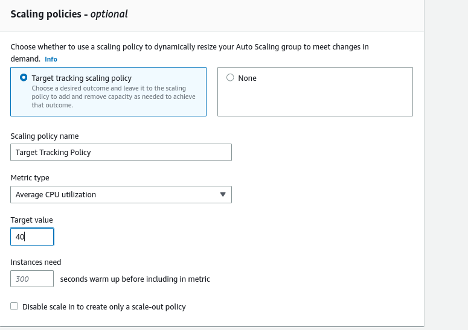

# auto-scale
Set up auto scale group in aws 

* Set up auto scale launch template with spot instances 

* Launch instance by tempalte 

* Set up maximum 2 instances in as group

* Set up policy by CPU usage 

* Set up alarm by requestCountPerTarget

 

* Set up policy with alarm 

* Our policy added a instance 

